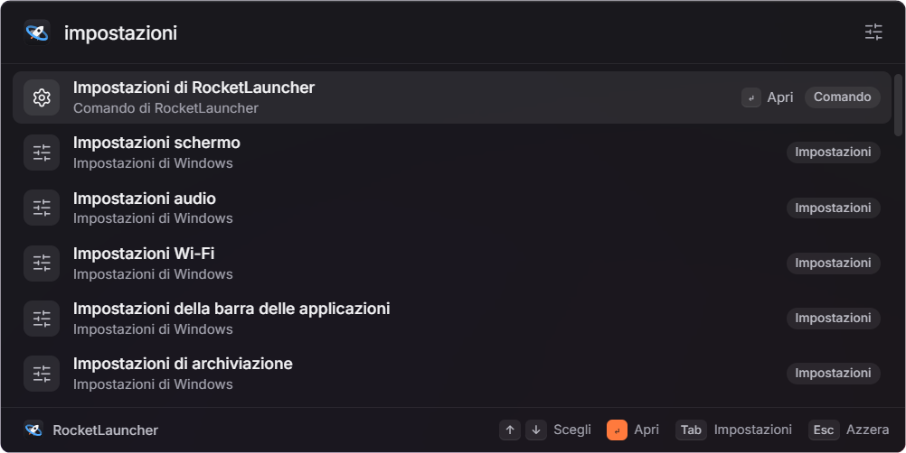
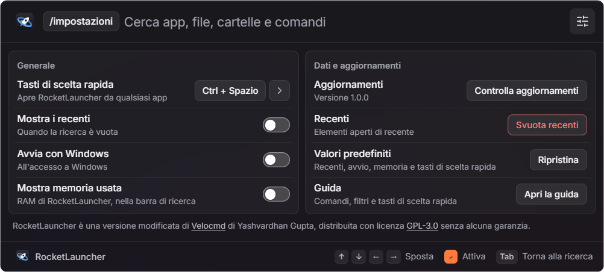
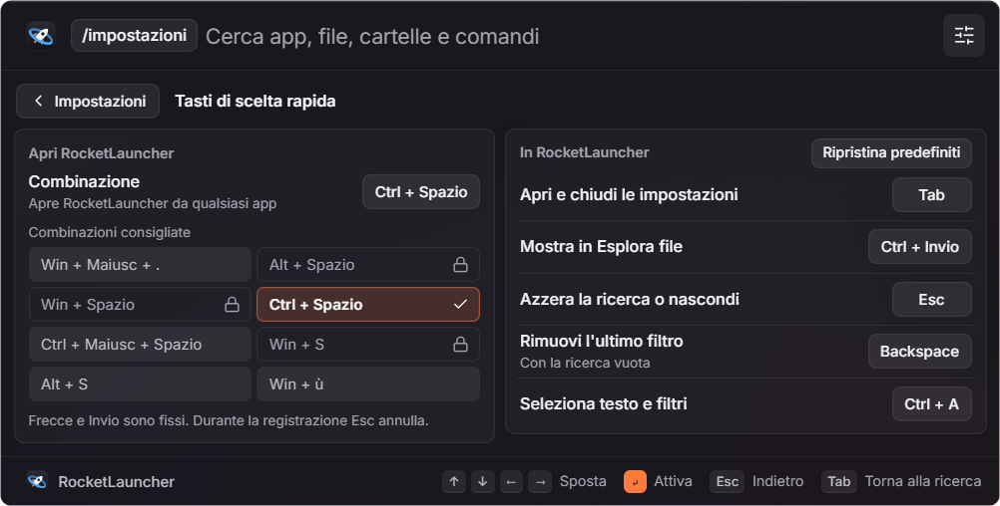
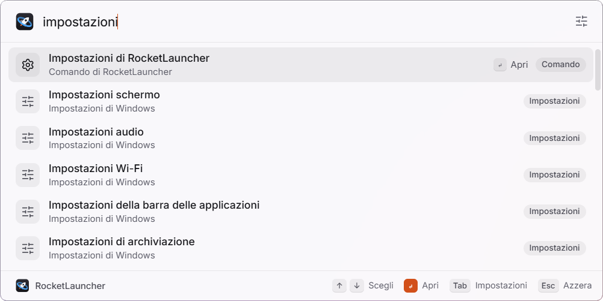
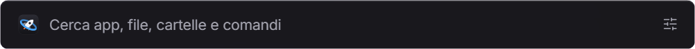

<p align="center">
  
</p>

<h1 align="center">RocketLauncher</h1>

<p align="center">A keyboard-first launcher for Windows: apps, files, folders, settings and commands, found as you type.</p>

<p align="center">
  <a href="https://github.com/leonardostagliano/RocketLauncher/releases/latest"></a>
  <a href="https://github.com/leonardostagliano/RocketLauncher/actions/workflows/windows-release.yml"></a>
  <a href="https://github.com/leonardostagliano/RocketLauncher/releases"></a>
  
  
  <a href="LICENSE"></a>
</p>

<p align="center">
  <a href="https://github.com/leonardostagliano/RocketLauncher/releases/latest"><b>Download</b></a> ·
  <a href="#features">Features</a> ·
  <a href="#how-it-works">How it works</a> ·
  <a href="#privacy">Privacy</a>
</p>

<p align="center">
  
  <br><sub>Search, on the Windows 11 Mica glass</sub>
</p>

## Why

Windows search is slow to index, mixes web results into local ones and needs the mouse more often than it should.
RocketLauncher opens with one shortcut over any window, searches an index of your apps and drives held in memory, and
opens what you pick with <kbd>Invio</kbd>. Filters narrow the results to apps, folders, a drive or a file type, and the
same bar switches windows, runs terminal commands, searches the web and controls media playback.

RocketLauncher is a fork of [Velocmd](https://github.com/YashvardhanG/Velocmd) by Yashvardhan Gupta, with a new name,
an Italian interface, a glass look, customizable keys and its own releases. See [Credits and license](#credits-and-license).

## Features

- **Search as you type.** Apps (Microsoft Store apps included), files, folders and drives, 33 Windows settings pages
  and system tools, and the launcher's own commands, in one list that updates on every keystroke. Programs and
  shortcuts show their real icon. Your Download, Immagini, Documenti, Musica, Video and Desktop folders come first
  when they match, then commands, then apps; exact and prefix matches on the name beat matches elsewhere in the path.
- **Italian first, English too.** Everything carries its Windows 11 Italian name ("Gestione attività", "Pannello di
  controllo", "Questo PC", "Arresta il sistema"…), and Velocmd's English names still work as aliases. Search ignores
  case and accents: `attivita`, `task manager` and `taskmgr` all find "Gestione attività".
- **Filters as chips.** Type a filter such as `/app` followed by a space and it becomes a chip in front of the search
  box; the text you type next is searched only inside it. Chips combine (`/c /pdf fattura`). Typing `/` or `@` alone
  lists the filters, one row per drive included. See [Filters](#filters).
- **Windows settings and tools.** Display, sound, Bluetooth, Wi-Fi, Windows Update, installed and startup apps, taskbar,
  power, storage, Task Manager, Control Panel, Registry Editor, Device Manager, Services, Disk Management, Event Viewer,
  environment variables and Command Prompt open straight from the bar.
- **Launcher commands.** `/rocket` lists help, settings, show or hide recents, clear recents, refresh the index, show
  the desktop, the open windows, quit, close the active tab or window, play/pause, next and previous track, and
  shutdown and restart, which always ask first with **"No, annulla"** preselected.
- **Window switching.** `/finestre` (or `/tabs`) lists the open windows by title, recognising browser tabs, VS Code,
  Discord and WhatsApp; <kbd>Invio</kbd> brings the window to the front and restores it if it was minimised.
- **Web search and sites.** `/google`, `/bing`, `/duck` and `/cerca` search the web; a query that starts with a
  question word (come, cosa, perché, quando, chi, dove… or how, what, why…) offers a web search too. `/web` lists
  preset sites and opens any address you type, such as `example.com`.
- **Private mode.** The `/p` chip opens web searches and addresses in a private window of your browser (Brave, Chrome,
  Edge or Firefox, preferring the default one) and saves nothing in the recents.
- **Terminal commands.** `/cmd <command>` (or `!cmd`) runs a command in a new Command Prompt window that stays open.
- **Open in File Explorer.** <kbd>Ctrl</kbd>+<kbd>Invio</kbd> selects a file or a program shortcut in File Explorer, or
  opens a folder or a drive.
- **Nox Dimmer.** `/nox` controls [Nox Dimmer](https://github.com/YashvardhanG/Nox-Dimmer), the upstream author's
  screen-dimming app, when it is installed: open, quit, Hyper mode, dimming up or down by 10%, updates and help.
- **Recents.** When turned on, the last 10 items you opened appear as soon as the bar opens. Only items that are safe
  to open again are kept: power actions, quit, filter suggestions and window handles never are.
- **Customizable keys.** Record any global shortcut (Velocmd's eight presets remain as quick picks) and rebind the
  five in-app actions, with checks that keep Windows' own combinations, AltGr characters and every app's editing keys
  safe. See [Keys](#keys).
- **A glass bar that stays out of the way.** The window follows the Windows light or dark app theme on Mica
  (Windows 11) or Acrylic (Windows 10). Closed it is only the search bar; open, an action bar names what
  <kbd>Invio</kbd> does on the selected row. It stays on top, hides when it loses focus, has no taskbar button and
  lives in the notification area.
- **Update check.** RocketLauncher asks this repository for its latest release and, when there is a newer one, opens
  its page. It never downloads or installs anything by itself.

## Screenshots

<table>
  <tr>
    <td align="center" valign="top">
      
      <br><sub>Settings</sub>
    </td>
    <td align="center" valign="top">
      
      <br><sub>Keys: the global shortcut and the in-app actions</sub>
    </td>
  </tr>
  <tr>
    <td align="center" valign="top">
      
      <br><sub>Light theme</sub>
    </td>
    <td align="center" valign="middle">
      
      <br><sub>Closed, only the search bar is shown</sub>
    </td>
  </tr>
</table>

## Getting started

### Requirements

- Windows 10 or Windows 11, x64.
- The Microsoft Edge WebView2 Runtime. It is part of Windows 11 and of an up-to-date Windows 10; the installers add it
  when it is missing, the portable build needs it already installed.

### Install and first run

1. Download one of the files from the [latest release](https://github.com/leonardostagliano/RocketLauncher/releases/latest):

   | File | What it is |
   |---|---|
   | `RocketLauncher-<version>-win-x64-setup.exe` | **Recommended.** Installs for the current user, without administrator rights, with a Start menu entry and an uninstaller. |
   | `RocketLauncher-<version>-win-x64.msi` | Windows Installer package for per-machine or managed installs. Needs administrator rights. |
   | `RocketLauncher-<version>-win-x64-portable.exe` | The bare executable, nothing to install. |
   | `SHA256SUMS.txt` | SHA-256 checksums of the three files above. |
   | `LICENSE.txt`, `THIRD-PARTY-LICENSES.txt` | The GPL-3.0 and the licences of everything built into the executable. |

2. The builds are not code-signed, so SmartScreen may show "Windows ha protetto il PC". Check the file first, then
   choose **Ulteriori informazioni** and **Esegui comunque**:
   ```powershell
   Get-FileHash .\RocketLauncher-<version>-win-x64-setup.exe -Algorithm SHA256   # compare with SHA256SUMS.txt
   ```
3. Start RocketLauncher. The Orbita icon appears in the notification area and the bar opens near the top of the screen.
4. The first start builds the index. The search box reads "Indicizzazione dei file in corso…" until it is ready, from
   a few seconds to a couple of minutes depending on your drives. Later starts load the saved index at once.
5. Press <kbd>Win</kbd>+<kbd>Maiusc</kbd>+<kbd>.</kbd> from anywhere to show or hide the bar, or click the tray icon.
   If the shortcut does nothing (another tool may take it), choose **Impostazioni** from the tray menu and record
   another one.

The interface is in Italian. RocketLauncher does not import anything from Velocmd: if Velocmd is also installed,
uninstall it or give the two apps different shortcuts.

## How it works

### The index

RocketLauncher does not use the Windows Search service: it builds its own index and keeps it in memory.

1. **Sources**, in this order: the Windows settings pages and system tools, the launcher's commands, the apps reported
   by `Get-StartApps` (Store apps included, with the names Windows shows in your language), the `.exe`, `.lnk` and
   `.url` entries of the Start menu, `%LOCALAPPDATA%\Microsoft\WindowsApps` and `%LOCALAPPDATA%\Programs` (without
   uninstallers, updaters and similar helpers), then every drive from `C:` to `Z:`, walked by several threads in
   parallel. Hidden dot-folders, `$Recycle.Bin` and `System Volume Information` are skipped.
2. **Storage.** All paths and names live in one large string; each entry keeps only the offsets of its path, its name
   and its search key (the lowercase, accent-free name plus its aliases) and its kind. A million entries need no
   per-entry allocation, and a search is a scan over contiguous memory.
3. **Refresh.** The index is rebuilt at every start, every 15 minutes and on **"Aggiorna l'indice dei file"**, on a
   thread at the lowest Windows priority. The new index replaces the old one in a single step and is saved to disk.
4. **Cache.** The saved copy (`index-v1.bin`) is loaded at start-up, so search works at once while the fresh index is
   being built. Only the very first start waits.
5. **Search.** Each keystroke runs one query on a background thread: filters first, then every entry whose search key
   or full path contains the text is scored, and the best 50 results come back. App icons are read from Windows once
   per index build and cached. Answers to an older keystroke that arrive late are dropped; a search that takes a
   moment shows "Ricerca in corso…".

### Filters

Every filter works with `/` or `@` in front (`/app` or `@app`), in Italian or in English.

| Filter | Shows |
|---|---|
| `/app` (`/applicazioni`, `/programmi`, `/apps`, `/exe`, `/lnk`) | Applications |
| `/cartelle` (`/cartella`, `/folders`, `/dir`) | Folders |
| `/file` (`/files`) | Files |
| `/unità` (`/unita`, `/disco`, `/drives`, `/disk`) | Drives |
| `/c` or `/c:` (any drive letter) | Items on that drive |
| `/pdf`, `/png`, `/docx`… (any other word) | Files with that extension |
| `/finestre` (`/schede`, `/tabs`, `/windows`, `/active`) | Open windows |
| `/rocket` (`/comandi`, `/impostazioni`, `/settings`) | RocketLauncher commands and five common Windows settings pages |
| `/impostazione` (`/configurazione`, `/setting`, `/config`) | All the Windows settings pages and system tools |
| `/pc` (`/questopc`, `/thispc`, `/computer`) | Questo PC, Cestino and your user folders |
| `/web` (`/siti`, `/sito`, `/sites`, `/url`) | Preset websites, or open a typed address |
| `/p` (`/privato`, `/incognito`) | Private mode |
| `/cmd` (`/esegui`, also `!cmd`) | Run a terminal command |
| `/cerca` (`/search`), `/google`, `/bing`, `/duck` (`/duckduckgo`) | Web search |
| `/nox` (`/nox-dimmer`) | Nox Dimmer controls |

Run and web-search words only act as the first word of the query: after another filter, `/cmd` is again the `.cmd`
extension (`/c /cmd build` lists the `build*.cmd` scripts on `C:`). A partial word such as `/cart` takes the
highlighted suggestion when you press <kbd>Invio</kbd> or <kbd>Tab</kbd>.

| Example | What it does |
|---|---|
| `/app discord` | Finds the Discord app, not the files that mention it |
| `/d /mp4 vacanze` | `.mp4` files on drive D: whose name or path contains "vacanze" |
| `/cmd ipconfig /all` | Runs `ipconfig /all` in a new Command Prompt window |
| `/p /google tauri` | Searches Google in a private window |

### Keys

| Keys | Action |
|---|---|
| <kbd>Win</kbd>+<kbd>Maiusc</kbd>+<kbd>.</kbd> | Show or hide RocketLauncher (default global shortcut) |
| <kbd>↑</kbd> / <kbd>↓</kbd>, <kbd>Invio</kbd> | Choose and open (fixed) |
| <kbd>Ctrl</kbd>+<kbd>Invio</kbd> | "Mostra in Esplora file" |
| <kbd>Tab</kbd> | "Apri e chiudi le impostazioni" (or turn a typed filter into a chip) |
| <kbd>Esc</kbd> | "Azzera la ricerca o nascondi": clears text, chips and settings, then hides an empty bar |
| <kbd>Backspace</kbd> on an empty box | "Rimuovi l'ultimo filtro" |
| <kbd>Ctrl</kbd>+<kbd>A</kbd> | "Seleziona testo e filtri" |
| <kbd>Spazio</kbd> after `/word`, `@word` or `!word` | Turn the word into a chip |

**Customizing.** Open the settings (<kbd>Tab</kbd>), then the arrow next to **"Tasti di scelta rapida"** for the page
with every key:

- **Global shortcut ("Apri RocketLauncher").** Click the combination (or select it and press <kbd>Invio</kbd>): it
  reads "Premi la combinazione…"; press the new keys, or <kbd>Esc</kbd> to keep the old ones. Velocmd's eight presets
  are listed as **"Combinazioni consigliate"**, with a check on the one in use and a lock on those that Windows keeps
  or another app already took on your PC. A combination needs <kbd>Ctrl</kbd>, <kbd>Alt</kbd> or <kbd>Win</kbd>
  (or is a function key F1–F24), and RocketLauncher refuses, with a short Italian reason, the ones that would break
  something: Windows' own (<kbd>Win</kbd>+<kbd>L</kbd>, <kbd>Alt</kbd>+<kbd>Tab</kbd>, <kbd>Win</kbd> + a letter…),
  <kbd>Ctrl</kbd>+<kbd>Alt</kbd> + a character (that is AltGr, which types `@ # [ ] €`), <kbd>Alt</kbd> + a keypad
  digit, the keys every app uses (<kbd>Ctrl</kbd> or <kbd>Ctrl</kbd>+<kbd>Maiusc</kbd> with A, C, V, X, Z, Y, S, F, P,
  W, T, N, O, Tab, Backspace, Canc, Home, Fine), one already registered by another app and one used by an in-app
  action. Keys are named by your layout: on an Italian keyboard Velocmd's "Win + /" preset is shown as "Win + ù".
- **In-app actions ("In RocketLauncher").** Each of the five actions above can take other keys. A key another action
  uses is refused ("Già usata per …"), and so are keys that would type in the search box or edit text, anything with
  AltGr or <kbd>Win</kbd>, and the global shortcut: `@`, which starts a filter, always reaches the search box. A
  changed key shows a restore button that brings back its default; **"Ripristina predefiniti"** restores all five.
  Arrows and <kbd>Invio</kbd> are fixed, and <kbd>Esc</kbd> always cancels a recording.
- The action bar and the tooltips always show your current keys. **"Ripristina"** under "Valori predefiniti" resets
  the keys together with the other settings.

If another app holds your global shortcut when RocketLauncher starts (it happens at sign-in), the first free preset
stands in for that session, the settings say so, and your combination is tried again at the next start.

### Showing and hiding

- The tray icon shows or hides the bar with one click; its menu has **"Mostra RocketLauncher"**, **"Impostazioni"**
  (shows the bar with the settings open, the way back when another program takes your shortcut) and **"Esci"**.
- The bar opens centred near the top of the screen, already cleared, and appears only once it is fully drawn, so the
  glass never flashes empty or with the previous search. It hides when you pick something, press <kbd>Esc</kbd> on an
  empty bar or click elsewhere.
- **"Avvia con Windows"** starts RocketLauncher at sign-in with `--autostart`: it stays in the notification area and
  indexes in the background until you call it. Starting it by hand, or a second time, shows the bar.
- Colours follow the Windows **app** theme: dark smoked glass or light glass. The material is Mica on Windows 11 and
  Acrylic on Windows 10; the environment variable `ROCKETLAUNCHER_MATERIAL=mica|acrylic|none` forces one or turns it
  off.

### Updates

At start-up and on **"Controlla aggiornamenti"**, RocketLauncher reads
`https://api.github.com/repos/leonardostagliano/RocketLauncher/releases/latest` and compares versions numerically. The
button then says "Già aggiornato", "Verifica non riuscita" or "Scarica la versione X", which opens the release page in
your browser: install the new version with the same file type you used. Settings, keys, recents and the index are kept.

## Privacy

- **No telemetry, no account, no analytics.** The index, the recents and the settings never leave your PC.
- **Network:** only `api.github.com`, to read this repository's latest release at start-up and when you check for
  updates. The web view runs under a Content Security Policy that allows no other host. Web searches and sites open in
  your browser, and only when you choose them.
- **Local only:** the file system and the Start menu, `Get-StartApps` through PowerShell, the titles of the open windows
  for `/finestre`, the default browser for private mode, and, for `/nox`, Nox Dimmer's local port `127.0.0.1:50291`.
  Other windows' titles, file names and what you type are always shown as plain text.

## Files

| Path | Contents |
|---|---|
| `%APPDATA%\it.stagliano.rocketlauncher\settings.json` | The global shortcut (`"shortcut"`) and the in-app keys you changed (`"keyBindings"`) |
| `%LOCALAPPDATA%\it.stagliano.rocketlauncher\index-v1.bin` | The saved copy of the index |
| `%LOCALAPPDATA%\it.stagliano.rocketlauncher\EBWebView\` | The WebView2 profile, which keeps the recents and the recents and memory switches |
| `HKCU\Software\Microsoft\Windows\CurrentVersion\Run`, value `RocketLauncher` | Present only while "Avvia con Windows" is on; it points at the executable, so a moved portable build needs the switch off and on again |

## Build from source

You need Windows 10 or 11, [Node.js](https://nodejs.org/) 22, the stable Rust MSVC toolchain from
[rustup](https://rustup.rs/), the [Visual Studio C++ Build Tools](https://visualstudio.microsoft.com/visual-cpp-build-tools/)
and the WebView2 Runtime.

```powershell
git clone https://github.com/leonardostagliano/RocketLauncher.git
cd RocketLauncher
npm ci
npm test               # release, contract, shortcut, contrast, logo and licence tests
npm run test:rust      # cargo test --locked
npm run tauri dev      # runs the app; changes to src/ reload live
npm run build:win      # src-tauri\target\release\RocketLauncher.exe plus the NSIS and MSI installers
npm run icons          # regenerates every icon from branding/rocketlauncher-icon.svg
npm run licenses       # regenerates THIRD-PARTY-LICENSES.txt after a dependency change
```

The frontend is plain HTML, CSS and JavaScript in `src/`, with no bundler; the backend (indexer, search, window and
Windows integration) is `src-tauri/src/main.rs`. A development run behaves like the installed app: it registers the
global shortcut and indexes every drive. Local builds keep the base version `0.1.8`; `--autostart` starts silently and
the hidden `--smoke=<version>` switch checks the build and exits before any window appears.

### Releases

Local builds publish nothing. `.github/workflows/windows-release.yml` runs on every push to `main` (and by hand with
*Run workflow*) on a Windows runner:

1. `node scripts/windows-release.mjs prepare` works out the version from the last published release (or from
   `package.json`) and the conventional commits since then: `feat:` → minor, `!` or `BREAKING CHANGE:` → major,
   everything else → patch. A commit already contained in a release creates no other one. The first release is
   **1.0.0**, a major bump over Velocmd's 0.1.8 brought by the rename.
2. `npm test`, `cargo test`, then `tauri build` with the computed version, the staging of the three binaries with
   `SHA256SUMS.txt` and the licences, and a smoke test of the version, the embedded files and the installers.
3. `node scripts/windows-release.mjs publish` creates the `v<version>` release as a draft with Italian release notes,
   verifies every upload and only then publishes it as *Latest*.

The version lives in tags and releases: the workflow never commits or pushes. [RELEASE.md](RELEASE.md) has the details
and the one-time setup of the repository.

## Known limitations

- The builds are not code-signed, so SmartScreen warns about them.
- Every keystroke scans the whole index. With millions of files the first search after start-up can take a few seconds
  while app icons are read; later searches are faster.
- Another tool can swallow the global shortcut even when Windows registered it: use the tray's **"Impostazioni"** to
  pick another one.
- A change of the Windows app theme is picked up at the next start of RocketLauncher.
- The bar cannot be moved. "Editor Criteri di gruppo locali" (gpedit.msc) is missing on Windows Home, and the `/nox`
  commands need Nox Dimmer installed.

## Credits and license

RocketLauncher is a modified version of [Velocmd](https://github.com/YashvardhanG/Velocmd) 0.1.8 by
**Yashvardhan Gupta**, who designed and wrote the original launcher: the in-memory indexer, the chip filters, the
commands and the Nox Dimmer integration all come from Velocmd. The changes made by Leonardo Stagliano since 2026-09-29
are summarised in [NOTICE.md](NOTICE.md) and listed in full in the git history. Nox Dimmer is a separate application
by the same author and is not part of RocketLauncher.

The interface bundles the Inter typeface (SIL Open Font License 1.1) and Lucide icons (ISC): see
[THIRD-PARTY-NOTICES.md](THIRD-PARTY-NOTICES.md). Every release also carries `THIRD-PARTY-LICENSES.txt` with the
licences of the Rust crates built into the executable.

RocketLauncher is free software, distributed under the GNU General Public License, version 3: see [LICENSE](LICENSE).
It comes with **no warranty**.
